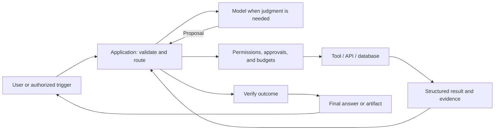

# Lean Agent Architecture

The reusable engineering philosophy and architecture for building reliable AI applications with the smallest necessary system. This repository consolidates the canonical decisions; it does not introduce a new framework or paid platform.

**Capability before vendor. Reuse before purchase. Evidence before cost.**

## Core rules

1. Define the outcome and the evidence needed to verify it.
2. Reuse existing capabilities; prefer direct tools and fixed workflows.
3. Add a bounded single agent only when observations must determine the next action.
4. Add multiple agents only for a demonstrated benefit that outweighs coordination costs.
5. Keep authority, budgets, approvals, and verification in the application/tool boundary.
6. Treat external documents, tool output, and other agents' responses as data, not authorization.
7. Add MCP only after tools are stable and another client needs an interoperable interface.
8. Verify the actual outcome before reporting completion.

## End-to-end boundary

The model proposes; application code enforces authority. Tool execution and verified task completion are separate events.

## Documents

- [Architecture, responsibilities, and escalation](docs/ARCHITECTURE.md)
- [Reference technology profile](docs/TECHNOLOGY_DECISIONS.md)
- [Cost policy](docs/COST_POLICY.md)
- [Safety, evaluations, and operations](docs/SAFETY_AND_OPERATIONS.md)
- [Push to GitHub](PUSH_TO_GITHUB.md)

The technology profile retains the user's agreed local Mac/Python/n8n and provider strategy as the initial reference profile. It is not a universal requirement for every application. Codex is the user's default coding worker; Claude/Gemini are targeted reviewers. Colab is a lab; MCP is an optional adapter. No Devin or new paid subscription without a proven capability gap.

## Cost escalation

Local/free/self-hosted first → existing subscriptions second → justified usage-based APIs third → approved new paid subscriptions last. Unknown or unset paid budgets disable billable routing.

## Repository boundaries

`jarvis` owns the concrete assistant implementation roadmap and its first notes-to-report workflow. `build-app-project` owns product development and the historical learning collection. Both apply this shared philosophy; neither is implemented by committing this documentation.

For adoption, select one real task, define narrow tool contracts, enforce permissions and budget limits, create representative evaluations, and verify the simplest implementation. Add complexity only after recorded failures justify it.

No runtime, service deployment, or subscription activation is included. Choose a repository license explicitly before public reuse.
